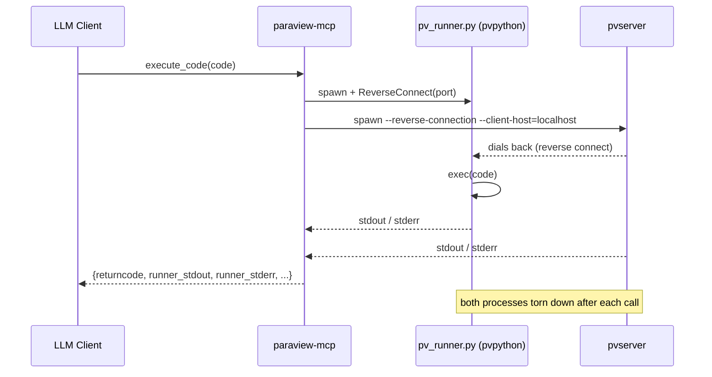

# pvpython-renderer

pvpython-renderer is an MCP server that gives LLM clients (OpenCode, Claude
Desktop, etc.) direct access to a ParaView session via a single tool:
`execute_code`. Each call runs arbitrary `paraview.simple` Python code in a
fresh, isolated ParaView session — no shared state, no manually managed
`pvserver`, no GUI required.

## About

Each `execute_code` call is fully self-contained: the server spawns a
`pv_runner.py` listener under `pvpython`, then launches a single-client
`pvserver` in reverse-connection mode to dial back to it. The supplied code
runs inside that session, all output is captured and returned, and both
processes are torn down. Multi-step workflows must be expressed within a single
`code` string.



## Installation & Configuration

### Prerequisites

- **conda** (Miniforge or Miniconda) with the `conda-forge` channel configured
- **linux-64 platform** — macOS and Windows are not supported
- **`pvserver` and `pvpython` on `PATH`** — provided by the
  `conda-forge::paraview` package installed via `environment.yaml`

### Installation

```bash
git clone https://github.com/NicholasSynovic/paraview_mcp.git
cd paraview_mcp/mcp/pvpython-renderer
conda env create -f environment.yaml -n paraview_mcp
conda activate paraview_mcp
pip install -e .
```

`pip install -e .` registers the `paraview-mcp` console script and installs the
`mcp` and `httpx` runtime dependencies. The `paraview` package is provided by
conda and is intentionally absent from `pyproject.toml` (it cannot be
pip-installed).

> **Python version:** the conda env _is_ the runtime. Its interpreter (Python
> 3.10, from the pinned `paraview=5.13.3=py310...` package) is what
> `paraview-mcp` runs on. `pyproject.toml`'s `requires-python = ">=3.10"` is
> advisory only.

### Running the server

```bash
conda activate paraview_mcp
paraview-mcp --server localhost --port 8080
```

`--server` (default `localhost`) and `--port` (default `8080`) set the
streamable-http bind address. The MCP endpoint is served at
`http://<server>:<port>/mcp`.

### Configuring OpenCode

This repository ships a ready-to-use [`opencode.json`](./opencode.json).
Launch OpenCode with it:

```bash
OPENCODE_CONFIG=opencode.json opencode
```

Or copy the `mcp` block into your global `~/.config/opencode/opencode.json`:

```json
{
    "$schema": "https://opencode.ai/config.json",
    "mcp": {
        "paraview": {
            "type": "remote",
            "url": "http://localhost:8080/mcp",
            "enabled": true
        }
    }
}
```

Start the server before launching OpenCode. If you use a non-default
`--server` / `--port`, update the `url` to match (keep the `/mcp` suffix).

### MCP Tool Reference

#### `execute_code`

Run arbitrary `paraview.simple` Python code in a fresh, stateless session.

```
execute_code(code: str) -> dict
```

**Arguments:**

| Argument | Type  | Description                                          |
| -------- | ----- | ---------------------------------------------------- |
| `code`   | `str` | Python source to run in a `paraview.simple` session. |

**Returns:**

| Key               | Type  | Description                                         |
| ----------------- | ----- | --------------------------------------------------- |
| `returncode`      | `int` | Exit code of the runner subprocess (`-1` on error). |
| `runner_stdout`   | `str` | Standard output from the `pvpython` runner.         |
| `runner_stderr`   | `str` | Standard error from the `pvpython` runner.          |
| `pvserver_stdout` | `str` | Standard output from the ephemeral `pvserver`.      |
| `pvserver_stderr` | `str` | Standard error from the ephemeral `pvserver`.       |

**Notes:**

- Each call starts from a blank ParaView session. There is no shared pipeline
  state between calls — multi-step workflows must be expressed within a single
  `code` string.
- The runner subprocess is terminated after a 120-second timeout.
- Both `pvserver` and `pvpython` must be on `PATH` at call time.
- Per-call logs are written to `~/paraview_logs/call_<timestamp>_runner.log`
  and `~/paraview_logs/call_<timestamp>_pvserver.log`.

## Development

### Environment setup

**One-shot (recommended):**

```bash
make create-dev
conda activate paraview_mcp
pip install -e .
```

`make create-dev` creates or updates the `paraview_mcp` conda env from
`environment.yaml`, installs the git pre-commit hooks, and runs
`uv sync --group dev` to install the dev dependency group.

**Manual:**

```bash
conda env create -f environment.yaml -n paraview_mcp
conda activate paraview_mcp
pip install -e .
uv sync --group dev
pre-commit install
```

### Pre-commit

Pre-commit is the source of truth for formatting and linting. Hooks include
`ruff-format`, `ruff-check`, `bandit`, and `prettier` (`prettier` requires
[`bun`](https://bun.sh) on `PATH`).

```bash
pre-commit run --all-files
```

### Updating `environment.yaml`

After adding or removing conda packages, regenerate the pin file:

```bash
make freeze
```

Verify afterwards that:

1. `channels:` lists `conda-forge` and `nodefaults` (in that order).
2. The `pip:` section does **not** contain a self-reference to `paraview-mcp`
   (`conda env export` will include the editable install — delete that entry
   before committing).

### Building a release artifact

```bash
make build
```

Clears `dist/`, sets the version from the latest git tag via `uv version`,
runs `uv build`, and reinstalls the resulting sdist. A git tag must exist
before running this.

## Troubleshooting

**Where are the logs?**

| Log                   | Path                                             |
| --------------------- | ------------------------------------------------ |
| Main server log       | `~/paraview_logs/pvpython_renderer_external.log` |
| Per-call runner log   | `~/paraview_logs/call_<timestamp>_runner.log`    |
| Per-call pvserver log | `~/paraview_logs/call_<timestamp>_pvserver.log`  |

Both the directory and all log files are created automatically on first run.

## Acknowledgements

pvpython-renderer is built on top of
[ParaView-MCP](https://arxiv.org/abs/2505.07064), created by Shusen Liu and
Haichao Miao at Lawrence Livermore National Laboratory, with contributions from
Peer-Timo Bremer. Their work introduced the concept of exposing `paraview.simple`
operations as MCP tools for LLM-driven scientific visualization. We are grateful
for their foundational contribution.

S. Liu, H. Miao, and P.-T. Bremer, "Paraview-MCP: Autonomous Visualization
Agents with Direct Tool Use," in _Proc. IEEE VIS 2025 Short Papers_, 2025.

```bibtex
@inproceedings{liu2025paraview,
  title={Paraview-MCP: Autonomous Visualization Agents with Direct Tool Use},
  author={Liu, S. and Miao, H. and Bremer, P.-T.},
  booktitle={Proc. IEEE VIS 2025 Short Papers},
  pages={00},
  year={2025},
  organization={IEEE}
}
```

## License

Distributed under the BSD-3-Clause license. See [LICENSE](./LICENSE) for the
full text.
