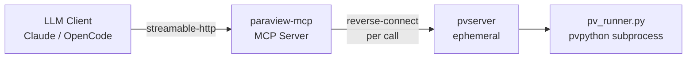

# ParaView-MCP

[](https://www.python.org/)
[](./LICENSE)
[](https://anaconda.org/conda-forge/paraview)

## Executive Summary

ParaView-MCP is an autonomous visualization agent that exposes `paraview.simple`
operations as tools over the Model Context Protocol (MCP), allowing LLM clients
such as Claude Desktop or OpenCode to drive a ParaView session entirely through
natural language. It bridges the gap between LLM reasoning and scientific
visualization by letting the model load data, create filters, configure color
maps, capture screenshots, and iterate on renderings without the user touching
the ParaView GUI.

The server exposes a **single tool**, `execute_code`, which runs arbitrary
`paraview.simple` Python code in a fresh, stateless session. Each call spawns
its own short-lived `pvserver` on an ephemeral local port and tears it down when
the call finishes — you do **not** start `pvserver` manually.

## Table of Contents

- [What is MCP?](#what-is-mcp)
- [Architecture](#architecture)
- [Prerequisites](#prerequisites)
- [Installation](#installation)
- [Development environment setup](#development-environment-setup)
- [Running](#running)
- [Integration: OpenCode](#integration-opencode)
- [Integration: Claude Code](#integration-claude-code)
- [Integration: Claude Desktop](#integration-claude-desktop)
- [MCP Tool Reference](#mcp-tool-reference)
- [Maintenance](#maintenance)
- [Troubleshooting / FAQ](#troubleshooting--faq)
- [Known Limitations](#known-limitations)
- [Contributing](#contributing)
- [Citation](#citation)
- [Authors](#authors)
- [License](#license)
- [Notice](#notice)

## What is MCP?

The [Model Context Protocol](https://modelcontextprotocol.io/) (MCP) is an open
standard that defines how LLM applications discover and call external tools,
resources, and prompts at runtime. By implementing an MCP server, ParaView-MCP
makes visualization operations available as typed, discoverable tools that any
compatible LLM client can invoke without custom integrations or bespoke APIs.

## Architecture



The LLM client sends `execute_code` calls to `paraview-mcp`. For each call the
server spawns a `pv_runner.py` listener (under `pvpython`), then launches a
single-client `pvserver` in reverse-connection mode to dial back to it. The
supplied code runs in the runner's full `paraview.simple` session, all output is
captured, and both processes are torn down. There is no shared pipeline state
between calls.

## Prerequisites

- **conda** (Miniforge or Miniconda) with the `conda-forge` channel configured
- **linux-64 platform** — macOS and Windows are not supported
- **`pvserver` and `pvpython` binaries** — ship with the `conda-forge::paraview`
  package; no separate install needed. Both must be on your `PATH` at runtime.

## Installation

```bash
git clone https://github.com/NicholasSynovic/paraview_mcp.git
cd paraview_mcp
conda env create -f environment.yaml -n paraview_mcp
conda activate paraview_mcp
pip install -e .
```

The `pip install -e .` step registers the `paraview-mcp` console script and
installs the `mcp` and `httpx` runtime dependencies. The `paraview` package
itself is provided by conda and is intentionally absent from `pyproject.toml`
(it cannot be pip-installed).

> **Python version:** the active conda env _is_ the runtime. Its Python
> interpreter (3.10, supplied by the pinned `paraview=5.13.3=py310...` package)
> is what `pip install -e .` and the `paraview-mcp` console script execute on.
> `.python-version` (`3.14`) and `pyproject.toml`'s `requires-python = ">=3.10"`
> are advisory only — they do not change the runtime interpreter.

## Development environment setup

Contributors need the runtime conda env plus the dev tooling (pre-commit, `ruff`,
`uv`) declared under `[dependency-groups].dev` in `pyproject.toml`.

### One-shot setup (recommended)

From an already-installed conda (with `conda-forge` configured), run:

```bash
make create-dev
```

This Makefile target:

1. Creates or updates the `paraview_mcp` conda env from `environment.yaml`
   (`conda env update --file environment.yaml --prune`).
2. Installs the git pre-commit hooks inside that env
   (`conda run -n paraview_mcp pre-commit install`).
3. Removes any leftover `.venv/` directory and runs `uv sync --group dev`
   inside the conda env to install the dev dependency group.

After it finishes, activate the env and you are ready to develop:

```bash
conda activate paraview_mcp
pip install -e .          # if you have not already, registers the console script
```

### Manual setup

If you prefer to do each step by hand:

```bash
# 1. Create the conda env (provides Python 3.10, paraview 5.13.3, pvserver)
conda env create -f environment.yaml -n paraview_mcp
conda activate paraview_mcp

# 2. Editable install of paraview-mcp itself
pip install -e .

# 3. Dev tooling (pre-commit, ruff, uv) from the `dev` dependency group
uv sync --group dev

# 4. Install the git pre-commit hooks
pre-commit install
```

### Pre-commit

Pre-commit is the source of truth for formatting and linting. The configured
hooks (`.pre-commit-config.yaml`) include `ruff-format`, `ruff-check`, `isort`,
`bandit`, the stock `pre-commit-hooks`, and `prettier` (invoked via `bunx`, so
you also need [`bun`](https://bun.sh) installed for the prettier hook to run).

Run all hooks across the repo with:

```bash
pre-commit run --all-files
```

### Updating `environment.yaml`

After adding or removing packages in the conda env, regenerate the pin file
with:

```bash
make freeze
```

This runs `conda env export -n paraview_mcp` (stripped of the machine-specific
`prefix:` line) and writes it to `environment.yaml`. **Manually verify**
afterwards that:

1. `channels:` still lists `conda-forge` and `nodefaults` (in that order).
2. The `pip:` section does **not** contain a self-reference to `paraview-mcp` —
   `conda env export` will include the editable install; delete that entry
   before committing.

### Building a release artifact

`make build` packages the project for distribution:

```bash
make build
```

It clears `dist/`, sets the project version from the latest git tag via
`uv version`, runs `uv build`, and reinstalls the resulting sdist with
`uv pip install dist/*.tar.gz`. A git tag must already exist for the
version-setting step to succeed.

## Running

Start the MCP server (inside the activated conda env):

```bash
paraview-mcp --server localhost --port 8080
```

`--server` (default `localhost`) and `--port` (default `8080`) set the
streamable-http bind address. The MCP endpoint is served at
`http://<server>:<port>/mcp`.

Both `pvserver` and `pvpython` must be on your `PATH`; the server shells out to
each per `execute_code` call.

## Integration: OpenCode

This repository ships a ready-to-use [`opencode.json`](./opencode.json) at its
root. Launch OpenCode with it via the `OPENCODE_CONFIG` environment variable:

```bash
OPENCODE_CONFIG=opencode.json opencode
```

Alternatively, copy the `mcp` block into your global
`~/.config/opencode/opencode.json`.

The shipped config registers the server as a `"type": "remote"` MCP entry
pointing at `http://localhost:8080/mcp`:

```json
{
    "$schema": "https://opencode.ai/config.json",
    "mcp": {
        "paraview": {
            "type": "remote",
            "url": "http://localhost:8080/mcp",
            "enabled": true
        }
    }
}
```

Start the MCP server before launching OpenCode:

```bash
paraview-mcp --server localhost --port 8080
```

> If you start the server with a non-default `--server` / `--port`, update the
> `url` to match (always keeping the `/mcp` path suffix).

## Integration: Claude Code

Add the following to `.mcp.json` in your project root (or
`~/.claude/mcp.json` for a global config):

```json
{
    "mcpServers": {
        "paraview": {
            "type": "remote",
            "url": "http://localhost:8080/mcp"
        }
    }
}
```

Start the server before using Claude Code:

```bash
paraview-mcp --server localhost --port 8080
```

## Integration: Claude Desktop

Add the following block to `claude_desktop_config.json`:

```json
{
    "mcpServers": {
        "paraview": {
            "type": "remote",
            "url": "http://localhost:8080/mcp"
        }
    }
}
```

Start the server before using Claude Desktop:

```bash
paraview-mcp --server localhost --port 8080
```

## MCP Tool Reference

### `execute_code`

Run arbitrary `paraview.simple` Python code in a fresh, stateless session.

```
execute_code(code: str) -> dict
```

**Arguments:**

| Argument | Type  | Description                                          |
| -------- | ----- | ---------------------------------------------------- |
| `code`   | `str` | Python source to run in a `paraview.simple` session. |

**Returns:** a dict with the following keys:

| Key               | Type  | Description                                         |
| ----------------- | ----- | --------------------------------------------------- |
| `returncode`      | `int` | Exit code of the runner subprocess (`-1` on error). |
| `runner_stdout`   | `str` | Standard output from the `pvpython` runner.         |
| `runner_stderr`   | `str` | Standard error from the `pvpython` runner.          |
| `pvserver_stdout` | `str` | Standard output from the ephemeral `pvserver`.      |
| `pvserver_stderr` | `str` | Standard error from the ephemeral `pvserver`.       |

Per-call log files are also written to `~/paraview_logs/`:
`call_<timestamp>_runner.log` and `call_<timestamp>_pvserver.log`.

**Notes:**

- Each call starts from a blank ParaView session; there is no shared state
  between calls. Multi-step workflows must be expressed within a single `code`
  string.
- The runner subprocess is killed after a 120-second timeout.
- Both `pvserver` and `pvpython` must be on `PATH`.

## Maintenance

### Updating pinned conda dependencies

Use `make freeze` and verify the result as described in
[Updating `environment.yaml`](#updating-environmentyaml) under the development
setup section. Commit the updated `environment.yaml` so the pinned environment
stays reproducible.

## Troubleshooting / FAQ

**1. `ModuleNotFoundError: No module named 'paraview'`**

`paraview` is only installable via conda, not pip. Activate the conda env
(`conda activate paraview_mcp`) before running `paraview-mcp`.

**2. `pvpython` or `pvserver` not found**

Both binaries must be on your `PATH`. Activate the `paraview_mcp` conda env,
which provides them via the `paraview` conda package.

**3. Where are the logs?**

The main server log is written to
`~/paraview_logs/pvpython_renderer_external.log`. Per-call logs are written to
`~/paraview_logs/call_<timestamp>_runner.log` and
`~/paraview_logs/call_<timestamp>_pvserver.log`. Both directories are created
automatically on first run.

**4. `paraview-mcp: command not found`**

The console script is registered by `pip install -e .`. Run that command from
the repo root (inside the conda env) and retry.

## Known Limitations

> The current implementation relies on a reverse-connection between `pvserver`
> and the runner subprocess. Each `execute_code` call starts a fresh session,
> so pipeline state does not persist between calls. Multi-step workflows must be
> expressed within a single `code` string.

## Contributing

See [CONTRIBUTING.md](./CONTRIBUTING.md) for guidelines on pull requests, branch
naming, commit style, and the code of conduct.

## Citation

If you use ParaView-MCP in published work, please cite:

S. Liu, H. Miao, and P.-T. Bremer, "Paraview-MCP: Autonomous Visualization
Agents with Direct Tool Use," in _Proc. IEEE VIS 2025 Short Papers_, 2025,
pp. 00.

```bibtex
@inproceedings{liu2025paraview,
  title={Paraview-MCP: Autonomous Visualization Agents with Direct Tool Use},
  author={Liu, S. and Miao, H. and Bremer, P.-T.},
  booktitle={Proc. IEEE VIS 2025 Short Papers},
  pages={00},
  year={2025},
  organization={IEEE}
}
```

## Authors

ParaView-MCP was created by Shusen Liu (<liu42@llnl.gov>) and Haichao Miao
(<miao1@llnl.gov>).

Current maintainer of this fork: [Nicholas Synovic](https://github.com/NicholasSynovic).

## License

ParaView-MCP is distributed under the terms of the BSD-3-Clause license. See
[LICENSE](./LICENSE) for the full text.

## Notice

Third-party attributions are recorded in [NOTICE](./NOTICE.md).
